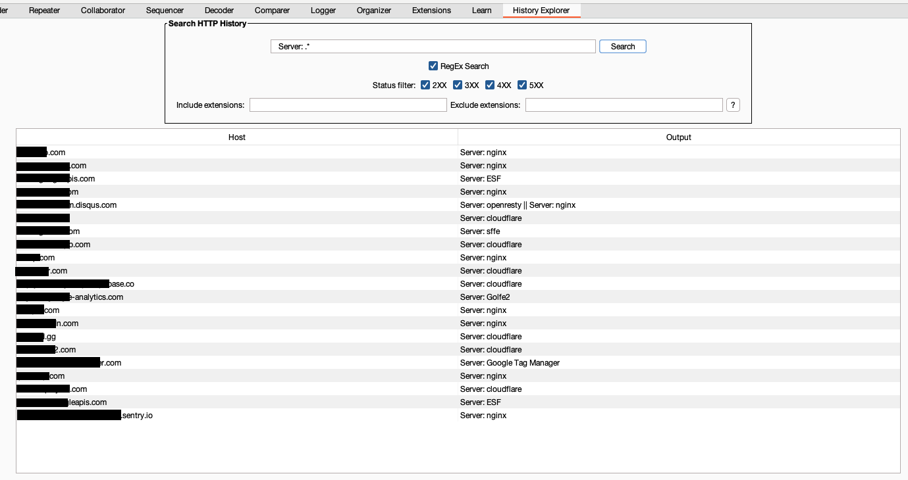

# Burp Suite History Explorer

This extension was developed to assist in filtering search results by host. 
During a large assessment I conducted, I wanted a clear view of which servers were operating on which software. While searching in Burp for the `Server: .*`, it returned the desired information, but I still had to sift through each request.

## Features

- Search using a literal string or a regex by selecting the `RegEx Search` checkbox.
- Choose the type of `status code` to include in the history search.
- Include or exclude file extensions in your search. Use the keyword `none` for requests without an extension.
- Results can be copied directly from the table using the standard `ctrl + c` combination.
- If multiple results occur on the same host, the values are separated by `||`.
- Filter only for in-scope items

## Screenshot

Searching with regex for the Server header.

Literal string search for nginx, and exclusion of requests with no extension, js, php, and css.

## Changelog

- v1.1 (19/02/2024)
  - Improved memory usage
  - Multithreaded execution
  - Option to filter in Requests or Responses only
  - Improved regex parsing

## Development

For bugs and feature ideas open an issue here.  